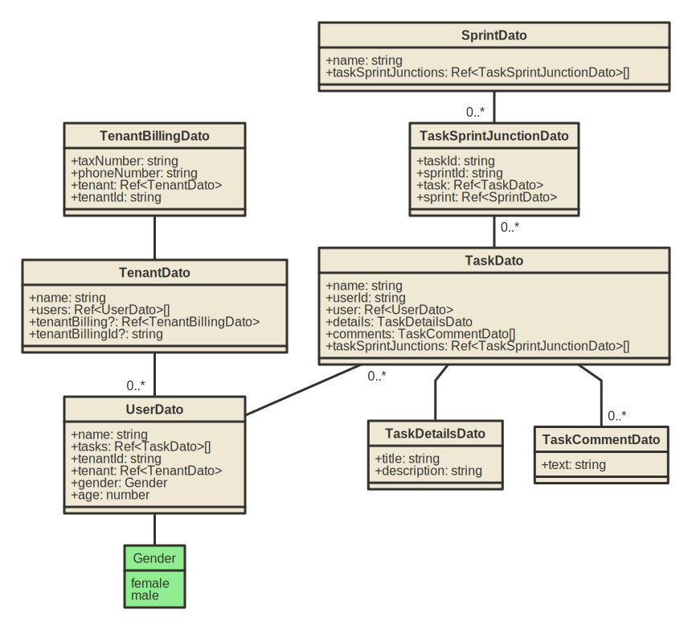

# Advanced

## Example app
* The [advanced-demo-app](https://github.com/choresh/nestjs-query-simple/tree/main/examples/advanced-demo-app) demonstrate usage of 'nestjs-query-simple' main capabilities.
* Diagram of DATOs (MongoDB/GraphQL objects) in the demo:
 

## Examples - DATOs/DTOs classes
* Standard object:
    * DATO (defining MongoDB/GraphQL metadata - what data should exists in specific MongoDB collection, and what data exposed in relevant GraphQL responses): [here](https://github.com/choresh/nestjs-query-simple/blob/main/examples/advanced-demo-app/src/tenants/datos/tenant.dato.ts#L14).
    * Input DTO (defining input parameters): [here](https://github.com/choresh/nestjs-query-simple/blob/main/examples/advanced-demo-app/src/tenants/dtos/tenant.dto.ts#L3).
    * Update DTO (defining update parameters): [here](https://github.com/choresh/nestjs-query-simple/blob/main/examples/advanced-demo-app/src/tenants/dtos/tenant.dto.ts#L15).
* Embedded (i.e. not refernced) objects:
    * At DATO [usage](https://github.com/choresh/nestjs-query-simple/blob/main/examples/advanced-demo-app/src/tasks/datos/task.dato.ts#L27), [definition](https://github.com/choresh/nestjs-query-simple/blob/main/examples/advanced-demo-app/src/tasks/datos/embeddeds/task-details.dato.ts).
    * At input DTO [usage](https://github.com/choresh/nestjs-query-simple/blob/main/examples/advanced-demo-app/src/tasks/dtos/task.dto.ts#L16), [definition](https://github.com/choresh/nestjs-query-simple/blob/main/examples/advanced-demo-app/src/tasks/dtos/embeddeds/task-details.dto.ts#L4).
    * At update DTO [usage](https://github.com/choresh/nestjs-query-simple/blob/main/examples/advanced-demo-app/src/tasks/dtos/task.dto.ts#L40), [definition](https://github.com/choresh/nestjs-query-simple/blob/main/examples/advanced-demo-app/src/tasks/dtos/embeddeds/task-details.dto.ts#L13).
* Virtual (calculated) objects: [class UserInfo](https://github.com/choresh/nestjs-query-simple/blob/main/examples/advanced-demo-app/src/users/users.service.ts#L20).

## Examples - DATOs/DTOs properties
* Passing types (embedded class, enum...) to decorator:
    * Specify embedded class type: [here](https://github.com/choresh/nestjs-query-simple/blob/main/examples/advanced-demo-app/src/tasks/datos/task.dato.ts#L25).
    * Specify enum type: [here](https://github.com/choresh/nestjs-query-simple/blob/main/examples/advanced-demo-app/src/users/dtos/user.dto.ts#L14).
    * Specify GraphQL scalar type: [here](https://github.com/choresh/nestjs-query-simple/blob/main/examples/advanced-demo-app/src/users/dtos/user.dto.ts#L19)
* One-to-one relation: [here](https://github.com/choresh/nestjs-query-simple/blob/main/examples/advanced-demo-app/src/tenantBillings/datos/tenantBilling.dato.ts#L21).
* One-to-many relation: [here](https://github.com/choresh/nestjs-query-simple/blob/main/examples/advanced-demo-app/src/tenants/datos/tenant.dato.ts#L20).
* Many-to-one relation: [here](https://github.com/choresh/nestjs-query-simple/blob/main/examples/advanced-demo-app/src/users/datos/user.dato.ts#L31).

## Examples - modules and services
* Resource service: [here](https://github.com/choresh/nestjs-query-simple/blob/main/examples/advanced-demo-app/src/tenants/tenants.service.ts).
* Resource resolver: [here](https://github.com/choresh/nestjs-query-simple/blob/main/examples/advanced-demo-app/src/tenants/tenants.resolver.ts).
* Resource module: [here](https://github.com/choresh/nestjs-query-simple/blob/main/examples/advanced-demo-app/src/tenants/tenants.module.ts).
* App module: [here](https://github.com/choresh/nestjs-query-simple/blob/main/examples/advanced-demo-app/src/app.module.ts).

## Examples - custom mutations/queries
Standard CRUD operations are supported 'out-of-the-box' by 'nestjs-query-simple', in case you want to add non-standard (custom) mutations/queries - see example method 'demonstrateComplexQuery()':
* In service: [here](https://github.com/choresh/nestjs-query-simple/blob/main/examples/advanced-demo-app/src/users/users.service.ts#L35).
* In resolver: [here](https://github.com/choresh/nestjs-query-simple/blob/main/examples/advanced-demo-app/src/users/users.resolver.ts#L16).

## Generate/update TS SDK
* The example app, has the capability to generate SDK (TS code, to be used by clients).
* The generation done via static code analysis, i.e. the generation can be done without running the app.
* To generate/update the SDK - run this command within the app's root folder:
    ```
    $ npm run generate
    ```
* The generated code will be file 'generatedApi.ts', within the app's root folder.
* You can add custom mutations/queries in folder 'customOperations' (e.g. versions that not ask to return all the entitie's properties), and after generation - the SDK will expose them.